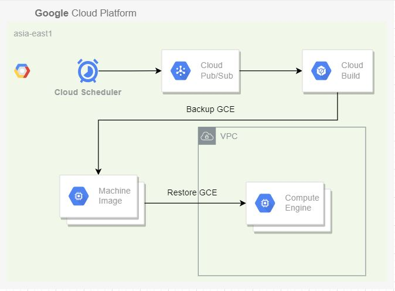

# GCE Backup Overview



## Configure GCE Backup

1. build the container image
```
git clone https://github.com/klin0024/gce-backup.git
cd gce-backup
docker build docker/ -t <YOUR-IMAGE>
docker push <YOUR-IMAGE>
```

2. edit the cloudbuild.yaml
```
vi cloudbuild.yaml
# modify the source of the container image
_IMAGE: <YOUR-IMAGE>
# modify project id
_PROJECT_ID: <YOUR-PROJECT-ID>
```

3. create the cloud source repository
```
gcloud source repos create gce-backup
```

4. configure credencial for the cloud source repository
```
touch ~/.gitcookies
chmod 0600 ~/.gitcookies
git config --global http.cookiefile ~/.gitcookies
echo "source.developers.google.com FALSE / TRUE 2147483647 o git-user=$(gcloud auth print-access-token)" > ~/.gitcookies
```

5. push the source code to the cloud source repository
```
git remote add google https://source.developers.google.com/p/<YOUR-PROJECT-ID>/r/gce-backup
git add cloudbuild.yaml
git commit -m "commit"
git push google
```

6. create the Cloud Pub/Sub topics 
```
gcloud pubsub topics create gce-backup --project=<YOUR-PROJECT-ID>
```

7. create the Cloud Build triggers
```
gcloud alpha builds triggers create pubsub --project=<YOUR-PROJECT-ID> \
--name=gce-backup \
--topic=projects/<YOUR-PROJECT-ID>/topics/gce-backup \
--substitutions=_INSTANCES='$(body.message.data.instances)',_RETAIN_DAYS='$(body.message.data.retainDays)' \
--repo=https://source.developers.google.com/p/<YOUR-PROJECT-ID>/r/gce-backup --branch=master \
--build-config=cloudbuild.yaml
```

8. create a Cloud Scheduler job 
Parameter |Type |Value |Description
:---|:---|:---|:---
instances |string |"< GCE 1 >:< AZ > < GCE 2 >:< AZ >" |Backup GCE
retainDays |integer |"7"  |Backup Retain Days
```
gcloud scheduler jobs create pubsub gce-backup --project=<YOUR-PROJECT-ID> --location=<YOUR-LOCATION> \
--schedule "15 2 * * *" --time-zone='<YOUR-TIMEZONE>' \
--topic gce-backup \
--message-body '{"instances":"gce1:us-central1-c gce2:us-central1-a gce3:us-central1-a","retainDays":"7"}'
```